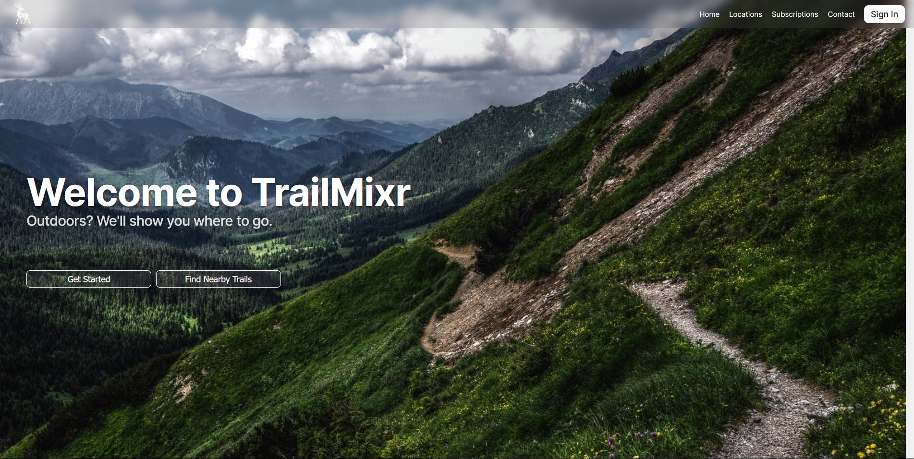

<div align="center">


</div>


<details>
<summary>Click me to view app screenshots</summary>



</details>

## Overview

TrailMixr is an innovative app that goes beyond basic trail planning, it's your intelligent companion for safe, multi-day hiking adventures in Canadian provincial parks. TrailMixr uniquely combines advanced algorithms, real-time environmental data, and community-driven insights to generate personalized trip plans. With features like proprietary safety and satisfaction scoring, citizen science integration, emergency plan closure, and recommendations based on topography, weather, and wildlife data, TrailMixr empowers users to explore the outdoors with confidence and contribute to conservation efforts.

## Project Vision

TrailMixr is more than just a trip planner, it's a movement to make the outdoors accessible, safe, and enjoyable for everyone. By bridging the gap between provincial park data and everyday users, TrailMixr is poised to transform the $48 billion camping industry.

## What Makes TrailMixr Unique?

- **Revolutionary Algorithm:** Proprietary technology that generates safe, optimized, and personalized multi-day hiking plans.
- **User-Friendly Interface:** Designed for all experience levels, making trip planning intuitive and enjoyable.
- **Citizen Science Platform:** Connects users with researchers to help preserve wildlife and natural beauty.
- **Data-Driven Conservation:** Facilitates the flow of real-world data from users to researchers, supporting conservation efforts.

## Features

- **Interactive Maps:** Explore trails, campsites, and parks with rich geospatial data.
- **Personalized Trip Planning:** Plan safe, multi-day journeys with elevation, weather, and route data.
- **Community & Science:** Share observations and contribute to scientific research.
- **Accessibility:** Designed to make the outdoors more accessible to all Canadians.
- **Plan Scores:** Each plan is rated for satisfaction, ease-of-use, and safety, helping users make informed decisions.
- **Safety Net:** Plan closure and emergency reporting features for peace of mind.

## What Does the TrailMixr App Do?

The TrailMixr app plans multi-day hikes through user-specified trails in supported provincial parks. Using a proprietary algorithm that combines existing data with data gathered from our user base, the app calculates a **plan satisfaction score**, **ease-of-use score**, and **safety score** for each proposed route. This empowers users to confidently choose and execute their desired adventure.

### Plans Generated by TrailMixr Include:

- **The Route Traveled:** A detailed map and itinerary of your multi-day journey, including all trail segments.
- **Departure and Arrival Times/Dates:** Optimized start and end times for each day, tailored to your preferences and daylight hours.
- **User Position Tracking:** Estimated user position at any given time, calculated via dead-reckoning based on your plan and progress.
- **Tent Pitching & Rest Locations:** Suggested overnight and rest stops, optimized using topography, solar exposure, and soil data for comfort and safety.
- **Amenity Locations:** Marked locations for washrooms, fishing spots, and other useful amenities along your route.
- **Hazard Identification:** Alerts for potential hazards (e.g., difficult terrain, wildlife, water crossings) along your planned path.
- **Equipment Optimization:** Personalized equipment recommendations based on your route and conditions.
  - *Free users* receive standard recommendations with sponsored content.
  - *Premium users* get access to gear tested and recommended by TrailMixr experts, with no ads.
- **Backup Plans:** Alternative routes and contingency plans in case of emergencies or unexpected events.
- **Plan Closure Options:** Ability to "close" your plan upon completion. If you fail to close your plan, TrailMixr can automatically initiate a missing person report to authorities for your safety.

## How TrailMixr Generates Plans

To create safe, satisfying, and optimized multi-day hiking plans, TrailMixr's proprietary algorithm analyzes a wide range of data sources:

- **Weather Analysis:** Forecasts and historical weather data for your planned dates, ensuring your trip is safe and comfortable.
- **Topography:** Elevation and terrain data sourced from OpenTopography, used to optimize routes and rest locations.
- **Sunlight Irradiation:** Sun exposure data from OpenSun, helping to plan for daylight hours and ideal tent pitching spots.
- **Temperature:** Real-time and historical temperature data from Environment and Climate Canada, for safety and comfort.
- **Soil Conditions:** Soil type and quality data from GeoHub, used to recommend suitable camping and rest locations.
- **Animal Habitats:** Wildlife and habitat data from GeoHub, to help avoid sensitive or dangerous areas and support conservation.

By combining these data sources, TrailMixr ensures that every plan is not only enjoyable and efficient, but also safe and environmentally responsible.

## The TrailMixr Advantage

By connecting provincial park data with everyday users and researchers, TrailMixr is uniquely positioned to:
- Empower outdoor enthusiasts with the tools and information they need.
- Support conservation and research through citizen science.
- Drive innovation in the outdoor recreation and camping industry.

## Getting Started

### Prerequisites
- Python 3.8+
- Django

### Setup

1. **Clone the repository:**
   ```bash
   git clone https://github.com/]/TrailMixr.git
   cd TrailMixr
   ```
2. **Install dependencies:**
   ```bash
   pip install -r requirements.txt
   ```
3. **Apply migrations:**
   ```bash
   python manage.py migrate
   ```
4. **Run the development server:**
   ```bash
   python manage.py runserver
   ```
5. **Open your browser:**
   Visit `http://127.0.0.1:8000/` to access the app.

## Running the Frontend

To view the frontend locally, serve the static files using Python's built-in HTTP server:

1. Open a terminal and navigate to the frontend directory:
   ```bash
   cd frontend
   ```
2. Start a simple HTTP server:
   ```bash
   python -m http.server 5500
   ```
3. Open your web browser and go to:
   [http://localhost:5500](http://localhost:5500)

This will serve the static site so you can view and interact with TrailMixr's frontend locally.

**Note:** If your frontend needs to communicate with the backend API, make sure the backend server is running as described above.

## Data Sources

- **Ontario Trail Network**
- **Ontario Parks**
- **Campsites and Elevation Data**
- **OpenTopography**
- **OpenSun**
- **Environment and Climate Canada**
- **GeoHub**

(See `additional/` directory for shapefiles and geospatial data)

## Roadmap

- User accounts and trip saving
- Community trip sharing
- Advanced route planning and export
- Mobile app

## Contributing

Contributions are welcome! Please open issues or submit pull requests for new features, bug fixes, or suggestions.

## License

This project is licensed under a custom license (TrailMixr Custom License). View more [here](LICENSE.md)

## Contact

For questions or support, open an issue on GitHub.
